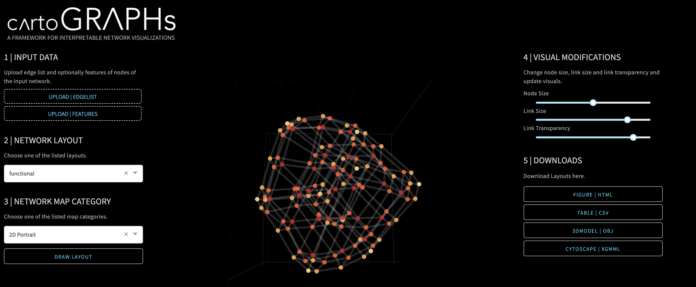
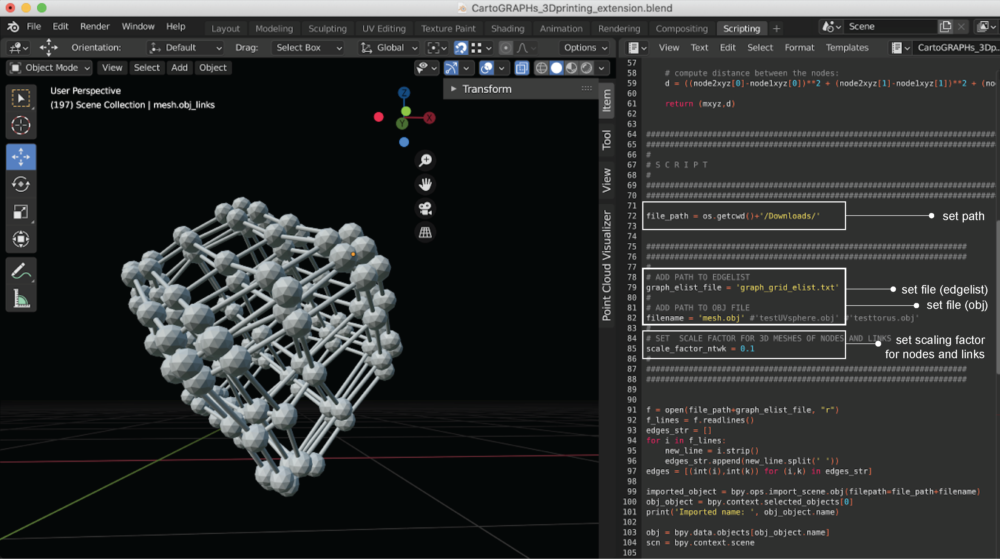

# cartoGRAPHs WEB APPLICATION

This repository is part of the project *menchelab/cartoGRAPHs* and contains the code for the web-based network visualization framework complementing the manuscript "Network cartoGRAPHs for Interpretable Visualizations". 

---

## A BASIC INTRODUCTION 

The Web application can be accessed [here](http://cartographs.xyz/) 
To explore different network layouts, we provide a model network of a cube lattice. The app is divided into sections, indicating the different steps of usage. 

#### STEP 1 - FILE UPLOAD
To generate layouts for a selected graph, please upload a graph edge list and a feature matrix. File requirements and structure can be found in the next section. 
Find an example file of an edge list [here](input/zacharygraph_edgelist.txt) and a feature matrix [here](input/zacharygraph_featurematrix.csv).  

#### STEP 2+3 - CHOOSE LAYOUT / MAP
Choose a network layout and a map in the dropdowns. To update the visualization, click on the button "DRAW LAYOUT". 
For more information on the individual layouts, please check out our manuscript and the github repo 

#### STEP 4 - MODIFY VISUAL SETTINGS
In this section, the node size, link size and transparency can be modified and adapted individually. 
To update the settings, again click on "DRAW LAYOUT".

#### STEP 5 - DOWNLOADS
The layouts can be downloaded the following: 
+ visualization (html)
+ table (csv) for the VRNetzer Platform (Pirch et al., Nat. Comm. 2021)
+ 3D model (obj) to be used for with our 3D printing extension in blender (see further instructions below)
+ cytoscape graph (xgmml)

---

## FILE STRUCTURE / FILE INPUT REQUIREMENTS

We provide four different graphs to test and get familiar with different layouts and maps.  
Please find one edgelist and one feature matrix per graph [here](cartoGRAPHs_app/input).  

The files look like the following:  
The edgelist should be a .txt file with one graph edge per line, i.e. nodeID1 nodeID2.  
Find an example [here](cartoGRAPHs_app/img/edgelist.png).  

The feature matrix is the basis for the functional layout and can contain any feature per node. 
The data should be stored in a dataframe and saved as a .csv file. It should include node IDs as strings in the first column and one feature per additional column.
Find an example [here](cartoGRAPHs_app/img/features.png).  

Please make sure that node IDs match both files, when producing your own graph files. 
The feature matrix is not required to include all nodes in the graph, but only the nodes which are associated to a feature. 

---

## FRAMEWORK EXTENSIONS
Here we introduce options to use the file formats that can be downloaded from the Web application.  
The layout table (.csv file) can be uploaded to the VRNetzer Platform to explore it immersively in Virtual Reality.  
For more information please check out the [repository](https://github.com/menchelab/VRNetzer) and [publication](https://www.nature.com/articles/s41467-021-22570-w).  
  
We also provide a 3D printable version of a graph. For 3Dprinting we suggest to use an .stl file, which can be generated using our framework extension. 
Please download an obj file of your graph from the web app and use our blender/python script extension provided [here](cartoGRAPHs_app/3Dprint_extension).

Some background info:   
Blender is an open-source 3D modeling software with an built-in python interpreter.  
To generate a 3Dprintable file from you graph please download blender [here](https://www.blender.org/) and check out the documentation on the python API [here](https://docs.blender.org/api/current/info_overview.html#:~:text=Blender%20has%20an%20embedded%20Python,active%20while%20Blender%20is%20running.&text=Blender%20provides%20its%20Python%20modules,data%2C%20classes%2C%20and%20functions.).  

Open blender and the provided files and change the filepath and filename to your .obj file and edgelist of your graph.  
Optionally you can change a scaling factor for node- and link size to influence the final output mesh.  
The blender interface looks like the following, with highlighted modifications needed, such as choosing the obj-file and edgelist of your graph.   

Save the mesh as an .stl file and use for example the free [Ultimaker CURA slicer](https://ultimaker.com/software/ultimaker-cura) for slicing to retrieve a 3Dprintable .gcode file to plug into your 3D printer. Happy printing! 

---

### COMPUTATION
Depending on network size (number of nodes and edges), the calculations will take between seconds or up to a few minutes.  
*Please note that this application is a work in progress and will be frequently updated and improved.*   

