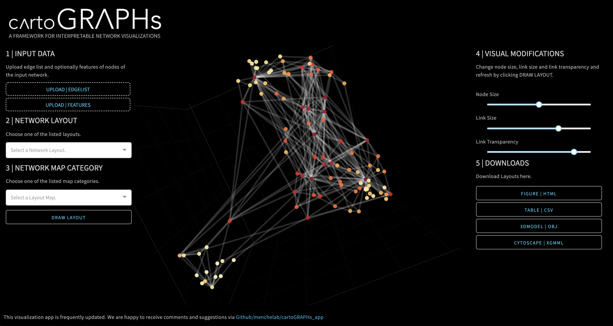

# cartoGRAPHs application 

This repository is part of the project *menchelab/cartoGRAPHs*. It contains a webbased network visualization framework complementing the manuscript "cartoGRAPHs - A Framework for Interpretable Network Visualizations". 

<p>&nbsp;</p>



<p>&nbsp;</p>

### INTRO

The app will load an exemplary visualisation at the very beginning. The example network can be used to explore the functionality of the application. 
A network edgelist generated with the [networkx package](https://networkx.org/) can be uploaded to generate different layouts and maps for visual network exploration. For more details in regard to the individual layouts and network maps integrated within the application, please visit the original project repository [*MENCHELAB/cartoGRAPHs*](menchelab/cartoGRAPHs). 
The following paragraph will introduce the basic step-wise functionality of this application. 
*Please note that this application is a work in progress and will be frequently updated and improved.* 


##### 1 | Set Input Data
To inspect an exemplary graph, please click the button stating *MODEL NETWORK* or upload a networkx edgelist (.csv or .txt format), with node IDs.

An examplary graph input file can be either a txt file in the following format: 
(An example file can be found in */input* > model_network_n100.txt)

```
4218 10133 {}
4218 9230 {}
4218 79735 {}
4218 1994 {}
3759 66008 {}
121441 66008 {}
... 
```

or a csv table with the following format: 
(An example file can be found in */input* > model_network_n200.csv)
```
57111,10133
57111,9230
57111,8766
79088,10133
79088,1994
... 
```


##### 2 | Choose Network Layout and Network Map 
When the upload is finished, the spinning wheel disappears and Network Layouts and Maps can be chosen and the button “Draw Layout” shall be pressed to draw the layout with a given input graph. 

To inspect the layouts rotate, zoom, hover over data points.
The data point hover information will display node ID. This feature will be extended soon, to upload for example node annotations.

##### 3 | Download your Layout
To download a 2D or 3D layout, the respective button, i.e. *FIGURE | HTML* shall be used. 
To download a csv file to be used for import into the VRNetzer platform [Pirch et al., 2021](https://www.nature.com/articles/s41467-021-22570-w) please press *TABLE | CSV*. 

---

### COMPUTATION
Depending on network size (number of nodes and edges), the calculations will take between seconds or up to a few minutes. A more in detail description of computational time to expect for a range of networks between 100 up to 20,000 nodes will be added here. 

